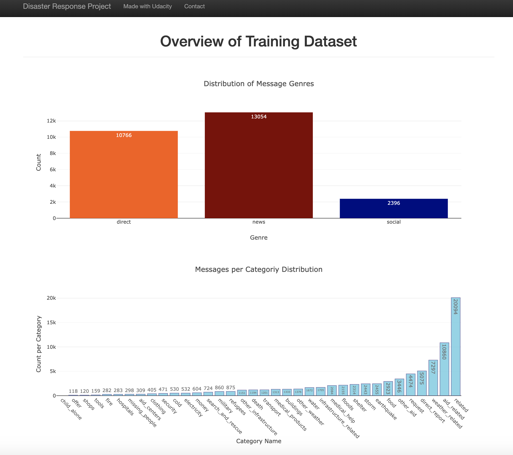
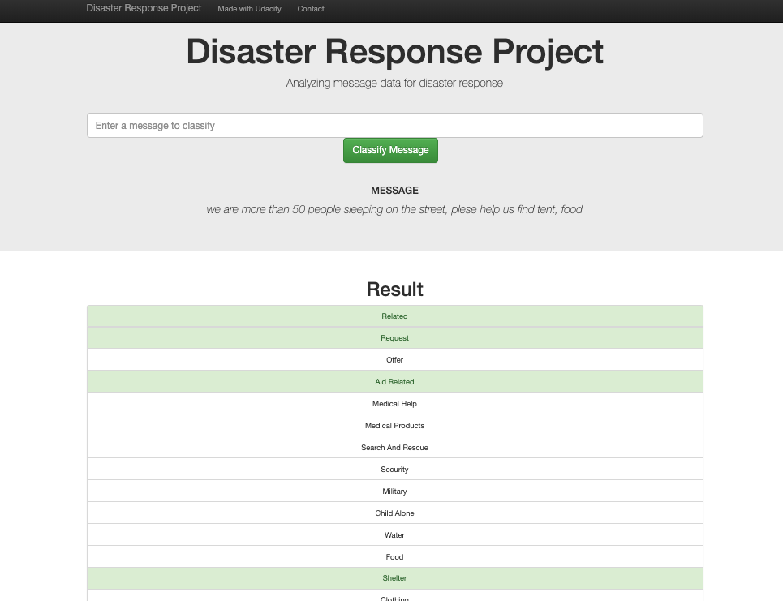

# Disaster Response Pipeline Project
Udacity Data Scientist Nanodegree Project

### Table of Contents

1. [Project Summary](#summary)
2. [File Structure](#file)
3. [Instructions](#instructions)
4. [Screenshots](#screenshots)

## Project Summary <a name="summary"></a>

The project analyze disaster data from <a href="www.figure-eight.com">Figure Eight </a> and builds a model for an API that classifies disaster messages. Data set used contains real messages sent during disaster events.

A web app is included where an emergency worker can input a new message and get classification results in several categories. The web app will also display visualizations of the data.

## File Structure <a name="file"></a>

```
- app
   | - template
		|- master.html  # main page of web app
		|- go.html  # classification result page of web app
	|- run.py  # Flask file that runs app

- data
	|- disaster_categories.csv  # data to process 
	|- disaster_messages.csv  # data to process
	|- process_data.py
	|- InsertDatabaseName.db   # database to save clean data to

- models
	|- train_classifier.py
	|- classifier.pkl  # saved model 

- README.md
```

## Instructions: <a name="instructions"></a>
1. Run the following commands in the project's root directory to set up your database and model.

    - To run ETL pipeline that cleans data and stores in database
        `python data/process_data.py data/disaster_messages.csv data/disaster_categories.csv data/DisasterResponse.db`
    - To run ML pipeline that trains classifier and saves
        `python models/train_classifier.py data/DisasterResponse.db models/classifier.pkl`

2. Run the following command in the app's directory to run your web app.
    `python run.py`

3. Go to http://0.0.0.0:3001/


## Screenshots: <a name="screenshots"></a>

#### How the Flask App looks like


#### Example from a message input and classification results in several categories


